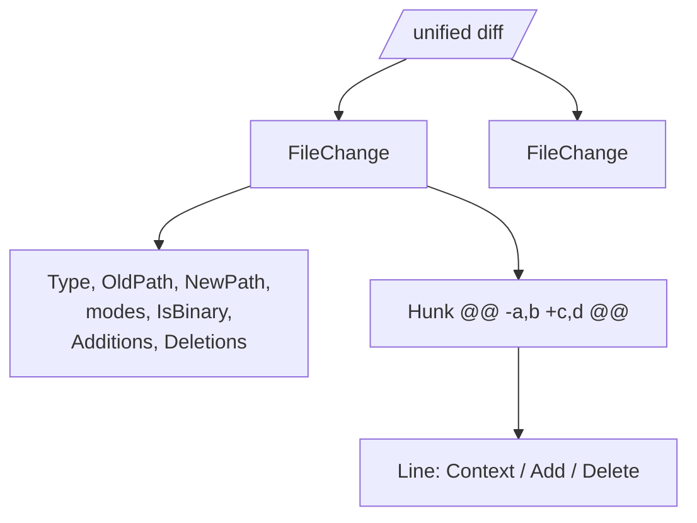

# The Diff Model

The diff inside a patch — or any standalone `git diff` — parses into a slice of
`FileChange`, each with its hunks. `Parse` does this for you and fills
`Patch.Files`; `ParseDiff` exposes it directly for diffs with no email around
them.

```go
files, err := mailpatch.ParseDiff(diffText)
```

## The shape



```go
type FileChange struct {
	OldPath   string
	NewPath   string
	Type      ChangeType // Modified | Added | Deleted | Renamed | Copied
	IsBinary  bool
	OldMode   string     // e.g. "100644"
	NewMode   string
	Additions int
	Deletions int
	Hunks     []Hunk
}
```

- `Path()` returns the current path — `NewPath`, or `OldPath` for a deletion.
- `Type` is inferred from `new file mode` / `deleted file mode` / `rename`/`copy`
  headers and from `/dev/null` on either side.
- `IsBinary` is set for `Binary files differ` and `GIT binary patch`.

## Hunks and lines

```go
type Hunk struct {
	OldStart, OldLines int
	NewStart, NewLines int
	Section            string // text after the closing @@
	Lines              []Line
}

type Line struct {
	Kind LineKind // Context | Add | Delete
	Text string   // leading +/-/space removed
}
```

Walk them to render or analyze:

```go
for _, f := range files {
	fmt.Printf("%s %s (+%d -%d)\n", f.Type, f.Path(), f.Additions, f.Deletions)
	for _, h := range f.Hunks {
		fmt.Printf("  @@ -%d,%d +%d,%d @@ %s\n",
			h.OldStart, h.OldLines, h.NewStart, h.NewLines, h.Section)
		for _, ln := range h.Lines {
			switch ln.Kind {
			case mailpatch.Add:
				fmt.Println("  +", ln.Text)
			case mailpatch.Delete:
				fmt.Println("  -", ln.Text)
			case mailpatch.Context:
				fmt.Println("   ", ln.Text)
			}
		}
	}
}
```

## Diffstat

`Patch.Stat` (and the counts on each `FileChange`) are computed from the parsed
hunks, not from the textual diffstat git prints — so they reflect what is
actually in the diff:

```go
type DiffStat struct {
	FilesChanged int
	Additions    int
	Deletions    int
}
```

## Bare diffs

`ParseDiff` does not need a git header. A plain `--- / +++ / @@` diff parses
too, which makes it handy for diffs pasted into issues or produced by tools
other than git. Unrecognized lines are ignored, so a diff embedded in
surrounding prose still parses.
