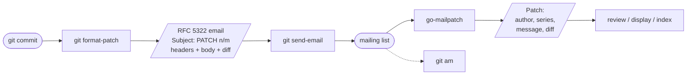

# go-mailpatch

`go-mailpatch` is a small Go library that reads `git format-patch` emails back
into structured data — author, date, series position, commit message, and a
fully parsed diff — using only the standard library and **without ever shelling
out to git**.

It grew out of [matcha](https://github.com/floatpane/matcha)'s developer-mail
features (inline patch review and `git-mail`), pulled into a standalone,
git-free, dependency-free package.

## The format-patch lifecycle

`go-mailpatch` sits on the **read** side: it parses what `format-patch` and
`send-email` produced, so your program can review, display, thread, or index a
patch. Applying it (`git am`) stays your responsibility — the library never
touches a repository.

## What it parses

- **The envelope.** From (split into name + email), Date, Subject, Message-ID,
  In-Reply-To, References — decoded from RFC 2047 encoded-words, with
  quoted-printable / base64 / multipart bodies handled.
- **The subject prefix.** `[PATCH 2/3]`, `[RFC PATCH v3 1/4]` → index, total,
  version, and a cover-letter flag, with a clean subject left over.
- **The diff.** Each file as a `FileChange` (change type, paths, modes, binary
  flag, hunks, add/delete counts), plus a `DiffStat` over the whole patch.
- **Whole threads.** `ParseMbox` for every message in an mbox; `ParseSeries` to
  group them into a cover letter plus ordered patches.

## What it is not

- **Not a patch applier.** No `git am`, no working-tree writes. Parse here,
  apply and validate yourself.
- **Not a diff renderer.** You get structure; coloring and printing are yours.
- **Not a full email stack.** It handles the headers and encodings
  format-patch mail uses in practice, not every RFC 5322 corner.

## Sister projects

| Project | Role |
|---------|------|
| [floatpane/matcha](https://github.com/floatpane/matcha) | Reference consumer — patch review and `git-mail`. |
| [floatpane/go-secretbox](https://github.com/floatpane/go-secretbox) | Sibling extraction — password-based encryption for data at rest. |

> [!NOTE]
> The import path is `github.com/floatpane/go-mailpatch` and the package name
> is `mailpatch`.
