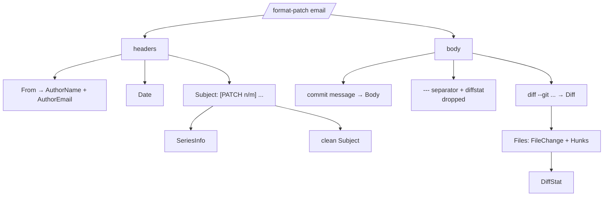

# Parsing a Patch

`Parse` turns one format-patch email into a `Patch`. This page covers what each
field holds and how the message is taken apart.

## Anatomy of a format-patch email



The body is split at the **first** `diff --git` line (or, for a bare diff with
no git header, the first `--- / +++` pair). Everything before the `---`
separator that precedes the diffstat becomes `Body`; the diffstat itself is
dropped. The trailing `-- \n<git version>` mail signature is stripped from
`Diff`.

## The Patch fields

```go
type Patch struct {
	From        string    // raw From header, RFC 2047 decoded
	AuthorName  string
	AuthorEmail string
	Date        time.Time

	Subject    string // prefix stripped
	RawSubject string // original subject line

	MessageID  string
	InReplyTo  string
	References []string

	Series SeriesInfo

	Body  string       // commit message
	Diff  string       // raw unified diff
	Files []FileChange // Diff parsed
	Stat  DiffStat

	Header mail.Header // full decoded headers
}
```

`HasDiff()` reports whether a diff was present; `IsCoverLetter()` reports a
`0/n` subject or a diff-less patch mail.

## Subject prefixes

The `[PATCH ...]` prefix is parsed into `SeriesInfo` and removed from
`Subject`:

```go
type SeriesInfo struct {
	Index   int    // n in "[PATCH n/m]"
	Total   int    // m
	Version int    // 2 for "v2"; 1 if unspecified
	Prefix  string // e.g. "PATCH" or "RFC PATCH"
	IsCover bool   // the "0/m" message
}
```

| Subject | Clean | Index | Total | Version | IsCover |
|---------|-------|-------|-------|---------|---------|
| `[PATCH] add thing` | `add thing` | 0 | 0 | 1 | false |
| `[PATCH 1/4] first` | `first` | 1 | 4 | 1 | false |
| `[PATCH v3 2/4] x` | `x` | 2 | 4 | 3 | false |
| `[RFC PATCH 0/2] cover` | `cover` | 0 | 2 | 1 | **true** |
| `[bug] not a patch` | `[bug] not a patch` | 0 | 0 | 1 | false |

> [!NOTE]
> Leading brackets are only treated as a patch prefix when they contain a
> `PATCH` or `RFC` token. A subject like `[bug] …` is left exactly as-is.

## Encodings and MIME

`Parse` decodes:

- **RFC 2047 encoded-words** in headers (`=?utf-8?q?...?=`).
- **quoted-printable** and **base64** message bodies, per the
  `Content-Transfer-Encoding` header.
- **multipart** messages — it extracts the first `text/plain` part.

So a patch mailed with a UTF-8 subject and a quoted-printable body parses
without any extra work from you.
