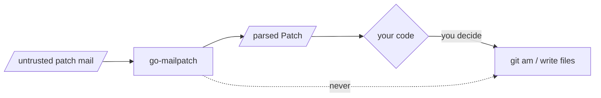

# Threat Model

`go-mailpatch` parses **untrusted input**. Patch emails come from whoever is on
a mailing list, so the security questions are about denial-of-service and
parser correctness — not cryptography.

## What it defends

- **No panics on malformed input.** Every parse function returns an error
  rather than panicking. If you can make it panic on some message, that is a
  bug worth reporting — code feeding it list mail relies on errors, not
  `recover`.
- **Bounded work.** Parsing is linear in the input; the regular expressions
  used for subjects, hunk headers, and paths are written to avoid catastrophic
  backtracking.

## What it does *not* do

- **It never executes git.** No subprocess, ever.
- **It never applies a patch.** No `git am`, no writes to a working tree, no
  file creation. `FileChange.Path()` is a *string from the diff*, not a path it
  will open.
- **It does not validate.** A parsed diff is not a safe diff. If you go on to
  apply it, you own the checks: path traversal (`../`), absolute paths,
  symlinks, size limits, and confirming the change is what review approved.

> [!WARNING]
> `Path()` and `OldPath`/`NewPath` come straight from attacker-controlled diff
> text. Before touching the filesystem with them, sanitize: reject absolute
> paths and any component that escapes your target directory.

## Reporting

Found a panic, a pathological input that hangs the parser, or a case where the
parsed result misrepresents the diff in a way that could slip a change past a
reviewer? Report it privately — see
[SECURITY.md](https://github.com/floatpane/go-mailpatch/blob/master/SECURITY.md).
Please do not open a public issue for a vulnerability.
