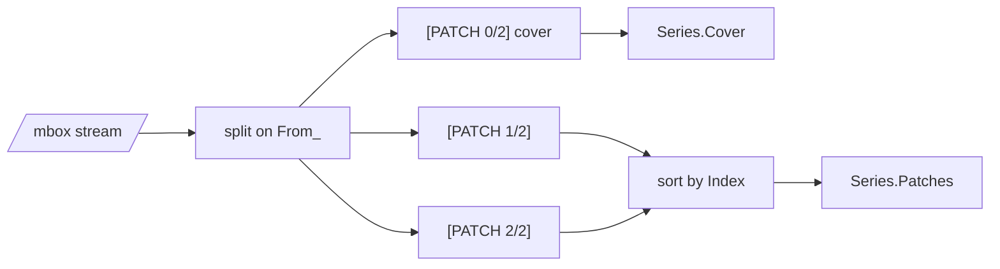

# Series & mbox

A real patch submission is usually more than one email: a `0/n` cover letter
followed by `1/n`, `2/n`, … each a separate message, all collected in an mbox
(`git format-patch --stdout`, or a saved thread). `go-mailpatch` reads the
whole thing.

## Every message: ParseMbox

```go
patches, err := mailpatch.ParseMbox(reader)
for _, p := range patches {
	fmt.Println(p.Series.Index, p.Subject, p.HasDiff())
}
```

`ParseMbox` splits the stream on the mbox `From ` delimiter and parses each
message in order, cover letters included. The delimiter line itself is
dropped — what remains starts with the real headers.

## Grouped: ParseSeries



```go
s, err := mailpatch.ParseSeries(reader)

if s.Cover != nil {
	fmt.Println("cover:", s.Cover.Subject)
}
fmt.Printf("v%d — %d of %d present (complete=%v)\n",
	s.Version, s.Len(), s.Total, s.Complete())

for _, p := range s.Patches { // sorted by Series.Index
	fmt.Printf("[%d/%d] %s\n", p.Series.Index, p.Series.Total, p.Subject)
}
```

`Series` separates the cover letter from the numbered patches and sorts the
latter by index:

```go
type Series struct {
	Cover   *Patch   // the "0/n" message, or nil
	Patches []*Patch // numbered, sorted by Index
	Version int      // highest "vN" seen, default 1
	Total   int      // m from "n/m", 0 if unknown
}
```

- `Len()` — number of numbered patches present.
- `Complete()` — `Total` is known **and** that many patches arrived. Use it to
  detect a thread that is missing `3/5`.

> [!NOTE]
> `ParseSeries` treats the stream as one series. A cover letter is identified
> by a `0/n` subject *or* simply having no diff. If a thread mixes several
> series, parse with `ParseMbox` and group by `Series.Version` / `Total`
> yourself.
